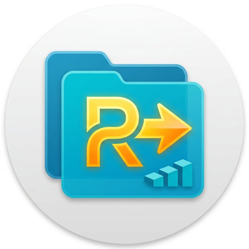

# remename



`remename` 是一个基于 Avalonia 和 .NET 10 的跨平台批量重命名工具。当前发布流程提供 Windows MSI 和 Android APK；Android 端可以通过 SMB 访问局域网共享目录，无需把文件复制到手机本地。

## 功能

- 批量查找并替换文件名中的文本
- 选择部分文件执行操作，避免误改整个目录
- 按名称、大小、扩展名和修改时间排序
- 按文件名过滤当前列表
- Android 专用触控布局
- Android SMB 连接、共享目录浏览和远程重命名
- 内置季度剧集文件名整理模式
- 使用 .NET `System.Diagnostics` 和 `System.IO` 记录运行日志
- Android 密码字段使用敏感输入模式，并禁止截图和录屏

## 重命名模式

### 普通替换

输入“搜索内容”和“替换为”，程序会对选中的文件执行文本替换。“替换为”可以留空，表示删除匹配文本。

例如：

```text
Movie.1080p.mkv -> Movie.mkv
```

### 模式 1：季度剧集

用于整理带发布组标签和集数标签的动画、字幕或剧集文件名。

处理规则：

- 移除文件名开头的第一组标签，例如 `[Group]`
- 将 `[01]` 这样的数字标签转换为季度和集数
- 将 `[OVA]` 转换为 `OVA`
- 输入 `02` 时自动规范为 `S02`
- 保留普通扩展名以及 `.sc.ass`、`.tc.ass` 复合扩展名
- 不符合规则的文件会被跳过

示例：

```text
[Group] Example [01].mkv       -> Example S02E01.mkv
[Group] Example [03].sc.ass    -> Example S02E03.sc.ass
[Group] Example [OVA].tc.ass   -> Example OVA.tc.ass
```

执行重命名前必须至少选中一个文件。

## Android SMB 使用方法

1. 启用“使用 SMB 网络共享”。
2. 输入服务器地址、用户名和密码。
3. 点击“连接”。
4. 从服务器根目录进入一个共享，再逐级进入目标文件夹。
5. 点击“使用当前文件夹”。
6. 选择需要处理的文件和重命名模式，然后执行重命名。

服务器地址可以使用主机名、IP 地址或带共享名的地址，例如：

```text
192.168.1.10
smb://192.168.1.10/videos
\\192.168.1.10\videos
```

SMB 使用 TCP 445 端口。手机与服务器需要网络互通，服务器账户也必须拥有目标目录的读取和重命名权限。

## 密码安全

Android SMB 密码框会向输入法声明以下属性：

- 密码内容类型
- 敏感输入
- 禁止输入建议和个性化学习

Android 窗口还启用了 `FLAG_SECURE`，用于阻止截图、录屏和最近任务预览捕获应用内容。不过，Android 应用无法保证用户安装的第三方输入法绝对可信。

程序不会把 SMB 密码写入日志。

连接成功后可以点击“保存凭证”。“已保存凭证”列表只读取并显示服务器地址和用户名，
不会加载密码；选择“使用”某条记录时，程序才会解密该记录的密码并填入登录表单。

在 Android 上，服务器地址和用户名以应用私有配置的明文元数据保存。密码使用
AES-GCM 独立加密，密钥由 Android Keystore 生成和保管且不可从应用配置中导出。
密文被篡改、密钥丢失或设备备份恢复后密钥不匹配时，认证校验会失败，对应记录会被删除，
不会退回明文存储。

## 日志

日志按日期保存，文件名格式为：

```text
remename-yyyyMMdd.log
```

Windows 默认目录：

```text
%LOCALAPPDATA%\remename\log
```

Android 日志保存在应用私有数据目录下的 `remename/log`，不需要外部存储权限。卸载应用时，该目录通常会被系统删除。

## 开发环境

- .NET SDK 10
- Windows 构建：Windows 10/11
- Android 构建：.NET Android workload 和 Android SDK

还原依赖：

```powershell
dotnet restore remename.sln
```

运行桌面端：

```powershell
dotnet run --project remename.Desktop/remename.Desktop.csproj
```

构建桌面端：

```powershell
dotnet build remename.Desktop/remename.Desktop.csproj -c Release
```

安装 Android workload 并构建 APK：

```powershell
dotnet workload install android
dotnet publish remename.Android/remename.Android.csproj -c Release -p:AndroidPackageFormat=apk
```

解决方案中还包含 iOS 和 Browser 平台外壳，但当前 GitHub Release 流程只发布 Windows 和 Android 安装包。

## GitHub Release

创建 GitHub Release 后，[发布工作流](.github/workflows/release.yml)会构建并上传：

```text
remename-Windows.msi
remename-Android.apk
```

Android 正式签名需要配置以下 Repository Actions Secrets：

| Secret | 用途 |
| --- | --- |
| `ANDROID_KEYSTORE_BASE64` | Base64 编码的 Android keystore |
| `ANDROID_KEY_ALIAS` | 签名密钥别名 |
| `ANDROID_KEY_PASSWORD` | 签名密钥密码 |
| `ANDROID_STORE_PASSWORD` | keystore 密码 |

未配置签名 Secrets 时，工作流只能生成未签名 APK，不适合正式分发或覆盖升级。发布过签名版本后，后续版本必须继续使用同一个 keystore 和 alias。

## 项目结构

```text
remename/             共享 UI、ViewModel 和业务逻辑
remename.Desktop/     Windows 桌面入口
remename.Android/     Android 入口和平台配置
remename.iOS/         iOS 平台外壳
remename.Browser/     浏览器平台外壳
.github/workflows/    Windows 与 Android 发布流程
```

## 操作注意事项

- 重命名是直接文件操作，目前没有撤销功能。
- 执行前应确认目标文件、季度和替换规则。
- 对重要目录操作前建议先备份。
- 如果目标文件名已经存在，操作会失败并记录日志，不会主动覆盖目标文件。
